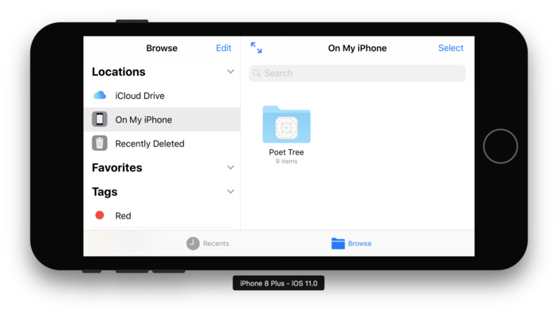
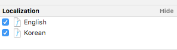
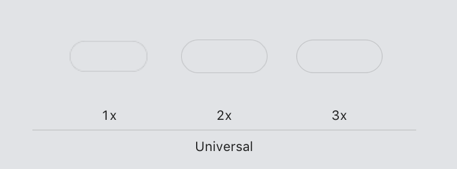
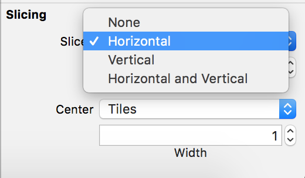
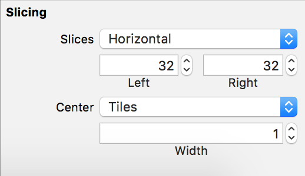

## Files App 에 앱 폴더 공유 하기

기존에 앱 내에의 도큐먼트 디렉토리를 사용하곤 했다. 

```swift
static let documentDirectory = NSSearchPathForDirectoriesInDomains(.documentDirectory, .userDomainMask, true).first!
static let documentDirectoryUrl = FileManager.default.urls(for: .documentDirectory, in: .userDomainMask).first!
```

ios 11 부터 제공하는 Files 앱 내에서 그 동안 첨부 파일을 다운로드 한 나의 앱 디렉토리를 공개하고 싶다면 아래와 같이 plist 에 아래와 설정한다.

```swift
<key>UIFileSharingEnabled</key>
<true/>
<key>LSSupportsOpeningDocumentsInPlace</key>
<true/>
```



위의 이미지와 같이 폴더가 보이고, 그 안에 저장한 파일들을 확인 할 수 있다. 

중요 파일들을 가리고 싶다면, 도큐먼트디렉토리 대신 아래와 같이 설정하도록 한다. 

```swift
static let hideDocumentDirectory = NSSearchPathForDirectoriesInDomains(.applicationSupportDirectory, .userDomainMask, true).first!
static let hideDocumentDirectoryUrl = FileManager.default.urls(for: .applicationSupportDirectory, in: .userDomainMask).first!
```

위와 같이 ios11 부터 제공하는 files 애플리케이션을 이용하여,  
다른 앱과 파일 공유도 가능하며, 내가 다운받은 파일들을 바로 확인 할 수 있다. 


## Info.plist Localization 

plist 에서 정의된 권한 요청 시 나오는 멘트를 Localization 하고 싶다 !! 

아래는 plist 에서 추가해 준 한글 멘트들이다. 

```swift
<key>NSCameraUsageDescription</key>
	<string>바로 촬영한 사진을 첨부할 수 있습니다.</string>
	<key>NSContactsUsageDescription</key>
	<string>연락처를 가져올 수 있습니다.</string>
	<key>NSMicrophoneUsageDescription</key>
	<string>동영상을 녹화할 수 있습니다.</string>
	<key>NSPhotoLibraryAddUsageDescription</key>
	<string>사진 및 동영상을 저장 또는 첨부할 수 있습니다.</string>
	<key>NSPhotoLibraryUsageDescription</key>
	<string>사진 및 동영상을 저장 또는 첨부할 수 있습니다.</string>
    <key>NSFaceIDUsageDescription</key>
    <string>Face ID를 사용하기 위해 접근 권한을 허용해야 합니다.</string>
```

`File > New > File..` 에서 `string file` 을 선택해준다.  
아래와 같이 원하는 Language 를 선택해준다. 


위의 xml파일 내의 `NSCameraUsageDescription` 키와 같이 사용해 준 값들을 원하는 한글/영문 설명을 string file 에 작성한다. 


아래는 영문 파일에 작성한 내용이다. 

```swift
"NSCameraUsageDescription" = "We use your camera to let you take photos and attach them directly to emails.";
"NSContactsUsageDescription" = "Mail use your address book to provide contact suggestions.";
"NSPhotoLibraryAddUsageDescription" = "We use your camera roll to let you attach photos to and save photos from your emails.";
"NSPhotoLibraryUsageDescription" = "We use your camera roll to let you attach photos to and save photos from your emails.";
"NSFaceIDUsageDescription" = "Allows 'Mail' to use Face ID for unlocking passcode.";
``` 

아래는 한글 파일에 작성한 내용이다. 

```swift
"NSCameraUsageDescription" = "바로 촬영한 사진을 첨부할 수 있습니다.";
"NSContactsUsageDescription" = "연락처를 가져올 수 있습니다.";
"NSPhotoLibraryAddUsageDescription" = "사진 및 동영상을 저장 또는 첨부할 수 있습니다.";
"NSPhotoLibraryUsageDescription" = "사진 및 동영상을 저장 또는 첨부할 수 있습니다.";
"NSFaceIDUsageDescription" = "Face ID를 사용하기 위해 접근권한을 하용해야 합니다.";
```

## AlertController Style 바꾸기

```swift
let alertController = UIAlertController(title: "title", message: "messages", preferredStyle: .alert)
```

위와 같이 alertController 를 만들었다.  
아래와 같이 title 에 적용할 attributedString 을 만들어준다. 

```swift
let title = "title"
let attrTitle = NSMutableAttributedString(attributedString: NSAttributedString(string: title))
attrTitle.addAttribute(NSAttributedStringKey.font, value: UIFont.systemFont(ofSize: 13), range: NSRange(location: 0, length: title.count))
```

만든 attributedString 를 alertController 에 적용해준다.  
```swift
alertController.setValue(attrTitle, forKey: "attributedTitle")
```

message 영역은 아래와 같이 적용해준다. 

```swift
alertController.setValue(messageAttr, forKey: "attributedMessage")
```

UIActionController 내에 들어가는 UIAlertAction 에서 checked 형식은 아래와 같이 설정해줄 수 있다. ( 텍스트 컬러 추가 ) 

```swift
let action = UIAlertAction(title: title, style: .default, handler: {(action: UIAlertAction) -> Void in
	actionHandler(index, title)
})
            
if let value = selectedValue, value == title {
	action.setValue(true, forKey: "checked")
}

action.setValue(UIColor.point(), forKey: "titleTextColor")
alertController.addAction(action)
```

## Xcode Asset 에서 stretch 사용하는 방법

아래와 같은 이미지의 가운데 부분만 양쪽으로 늘리고 싶을 때 아래와 같이 설정을 해준다.  


늘리려는 이미지를 선택 한 후 오른쪽 inspector 에서 slicing 을 찾는다.  

왼쪽 오른쪽 방향으로 늘리고 싶을 때 Horizontal,  
위 아래 방향으로 늘리고 싶을 때 Vertical,  
모든 방향으로 늘릴 때 Horizontal and Vertical 을 사용한다.  


위의 이미지는 1x 짜리 이미지가 width 가 65 일 때 가운데 1px 만 남겨두고 양쪽을 늘리고 싶다면 아래와 같이 설정한다.  


