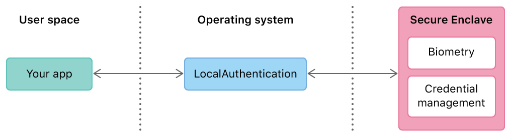

# Frameworks

## Photos

Assets 을 가져올 때 사전에 캐싱처리 하는게 필요할 때가 있다.  
`PHCachingImageManager`를 이용하는데, `PHCachingImageManager`는 `PHImageManager`의 하위 클래스이다.

```swift
PHCachingImageManager().startCachingImages(for: assets, targetSize: thumbnailSize, contentMode: .aspectFill, options: nil)
```
와 같은 방법으로 캐싱하게되는데 targetSize, ContentMode, Options 이 일치해야한다. 


### Display UICollectionCell with PHAsset

앨범의 사진들을 불러와 뿌려줄 때 cell 을 재사용하면서 다시 비워주고 컨텐츠를 비워줌에도 불구하고,  
다른 사진들의 썸네일이 indexPath 에 노출 될 경우가 있다. 

그럴 때 PHAsset 의 `localIdentifier` 를 사용한다.

```swift
cell.representedAssetIdentifier = asset.localIdentifier
```
해당 셀에 위와 같이 asset 의 localIdentifier 를 저장시켜주고, 

이미지 데이터를 요청 할 때 해당 셀에 미리 저장시켰던 localIdentifier 와 비교하여  
같을 경우에만 이미지를 노출 시킬 수 있도록 해준다.

```swift
imageManager.requestImage(for: asset, targetSize: thumbnailSize, contentMode: .aspectFill, options: nil, resultHandler: { image, _ in
    
    if cell.representedAssetIdentifier == asset.localIdentifier {
        cell.thumbnailImage = image
    }
})
```

### PHImageRequestOptions

`startCachingImages`을 하거나 `requestImage` 를 호출할 때 options 을 넘기는 부분이 있다. 

>deliveryMode: PHImageRequestOptionsDeliveryMode 

이미지의 화질보다 이미지를 불러오는 속도에 우선순위를 두거나,  
이미지를 불러오는 속도보다는 고화질의 이미지를 얻을 때 또는 자동으로 알아서 불러 올 수 있도록 설정할 수 있다. 

>resizeMode: PHImageRequestOptionsResizeMode

이미지를 요청할 때의 이미지 사이즈를 요청한 타겟 사이즈에 어떻게 맞출 것인지 설정하는 부분이다.

>isNetworkAccessAllowed: Bool

만약 true 로 설정했을 경우, 로컬에 이미지가 없을 경우 iCloud에서 불러 올 수 있다. 

## LocalAuthentication

> 사용자가 이미 알고 있는 암호나 생체 인식으로 사용자를 인증한다. 

많은 사용자는 Face ID 또는 Touch ID와 같은 생체 인식 인증을 사용하여 기기에 안전하고 쉽게 액세스할 수 있다. 대체 옵션으로서 생체 측정 기능이 없는 장치의 경우 암호나 암호가 유사한 목적을 제공한다. LocalAuthentication 프레임웍을 사용하여 앱에서 이러한 메커니즘을 활용하고 앱에서 이미 구현한 인증 절차를 확장한다. 



보안을 극대화하기 위해 앱은 기본 인증 데이터에 액세스할 수 없다. 예를 들어 지문 이미지는 액세스할 수 없다. 다른 시스템으로부터 격리된 하드웨어 기반 보안 프로세서인 Secure Enclave는 운영 체제에서도 이 데이터를 관리한다. 대신 특정 정책을 지정하고 사용자에게 인증 이유를 알려주는 메시지를 제공한다. 그런 다음 프레임워크가 Secure Enclave와 조정되어 작업을 수행한다. 이후 인증 성공 또는 실패를 나타내는 Bool값만 전달한다. 


