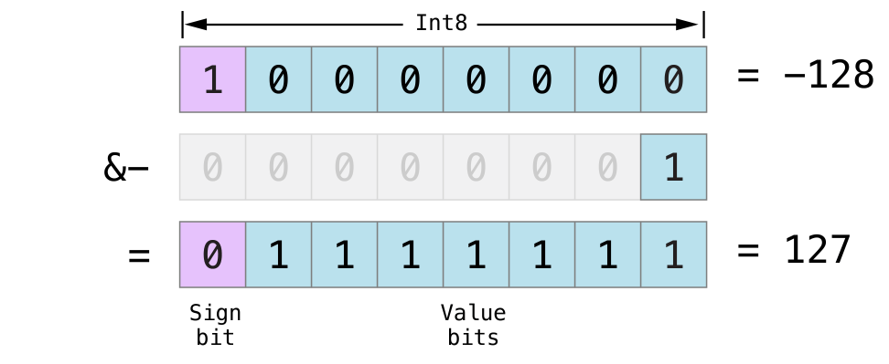

# Swift

## String

### Operators

#### `..<(_:_:)`
```swift
static func ..< (minimum: String, maximum: String) -> Range<String>
```

minimum 보다 크거나 같고 maximum 보다 작은 범위를 리턴한다. 

```swift
let lessThanFive = 0.0..<5.0
print(lessThanFive.contains(3.14))  // Prints "true"
print(lessThanFive.contains(5.0))   // Prints "false"
```

#### `...(_:_:)`
```swift
static func ... (minimum: String, maximum: String) -> ClosedRange<String>
```
minimum 보다 크거나 같고, maximum 보다 작거나 같은 범위를 리턴한다.


```swift
let lowercase = "a"..."z"
print(lowercase.contains("z"))
// Prints "true"
```

#### `..<(_:)`
```swift
prefix static func ..< (maximum: String) -> PartialRangeUpTo<String>
```
maximum 보다 작은 범위를 리턴한다. 

```swift
let upToFive = ..<5.0

upToFive.contains(3.14)       // true
upToFive.contains(6.28)       // false
upToFive.contains(5.0)        // false
```

#### `...(_:)`
```swift
prefix static func ... (maximum: String) -> PartialRangeThrough<String>
```

maximum 보다 작거나 같은 값의 범위를 리턴한다. 

```swift
let throughFive = ...5.0

throughFive.contains(4.0)     // true
throughFive.contains(5.0)     // true
throughFive.contains(6.0)     // false 
```

#### `...(_:)`
```swift
postfix static func ... (minimum: String) -> PartialRangeFrom<String>
```
minimum 이상의 범위를 반환한다. 

```swift
let atLeastFive = 5.0...

atLeastFive.contains(4.0)     // false
atLeastFive.contains(5.0)     // true
atLeastFive.contains(6.0)     // true
```

## Array

### `swapAt(_:_:)`
> 주어진 파라메터의 인덱스로 배열의 값을 교환한다. 

```swift
mutating func swapAt(_ i: Int, _ j: Int)
```

### `joined(separator:)`
> seperator 로 join 하여 새로운 스트링을 생성한다. 

```swift
func joined(separator: String = default) -> String
```
array 의 element 들이 `StringProtocol`를 준수할 경우에만 가능하다. 

예제는 아래와 같다. 

```swift
let cast = ["Vivien", "Marlon", "Kim", "Karl"]
let list = cast.joined(separator: ", ")
print(list)
// Prints "Vivien, Marlon, Kim, Karl"
```


### `randomElement()`
> 랜덤으로 배열의 값을 리턴

```swift
func randomElement() -> Element?
```

예제는 아래와 같다. 

```swift
let names = ["Zoey", "Chloe", "Amani", "Amaia"]
let randomName = names.randomElement()!
// randomName == "Amani"
```

### `randomElement(using:)`
> number generator 랜덤으로 배열의 값을 리턴

```swift
func randomElement<T>(using generator: inout T) -> Element? where T : RandomNumberGenerator
```

예제는 아래와 같다. 

```swift
let names = ["Zoey", "Chloe", "Amani", "Amaia"]
let randomName = names.randomElement(using: &myGenerator)!
// randomName == "Amani"
```

`RandomAccessCollection`을 준수하는 콜렉션의 경우에는 O(1) 복잡도를 가진다. 

### `first(where:)`
> where  오는 조건에 알맞는 배열의 첫번째 값을 리턴한다.

```swift
func first(where predicate: (Element) throws -> Bool) rethrows -> Element?
```

아래의 배열에서 where 로 들어오는 조건에서는 배열 element 의 값이  
0보다 작은 값 중에 첫번째 값을 리턴하도록 한다. 
결과값은 -2가 된다. 

```swift
let numbers = [3, 7, 4, -2, 9, -6, 10, 1]
if let firstNegative = numbers.first(where: { $0 < 0 }) {
    print("The first negative number is \(firstNegative).")
}
// Prints "The first negative number is -2."
```

### `firstIndex(of:)`
> of 로 들어오는 값과 일치하는 값들 중에 첫번째 index 를 리턴한다. 

```swift
func firstIndex(of element: Element) -> Int?
```

아래의 예제에서 "Maxime"의 값을 찾아 배열의 해당 값의 index 를 리턴한다. 
index 값이 있을 때 값을 바꾸는 예제를 확인 할 수 있다.

```swift
var students = ["Ben", "Ivy", "Jordell", "Maxime"]
if let i = students.firstIndex(of: "Maxime") {
    students[i] = "Max"
}
print(students)
// Prints "["Ben", "Ivy", "Jordell", "Max"]"
```

### `firstIndex(where:)`
> where 로 주어진 조건문에 해당하는 배열의 값의 첫번째 index 를 찾아 리턴한다. 


```swift
func firstIndex(where predicate: (Element) throws -> Bool) rethrows -> Int?
```

아래의 where 조건으로는 element 값이 A로 시작하는 것을 찾고,  
해당 하는 값이 있을 경우 그 element 의 index 의 값을 리턴한다. 

```swift
let students = ["Kofi", "Abena", "Peter", "Kweku", "Akosua"]
if let i = students.firstIndex(where: { $0.hasPrefix("A") }) {
    print("\(students[i]) starts with 'A'!")
}
// Prints "Abena starts with 'A'!"
```

### `shuffled(using:)`
> 주어진 랜덤 generator 로 섞어 다시 리턴해준다. 

```swift
func shuffled<T>(using generator: inout T) -> [Element] where T : RandomNumberGenerator
```

예제는 아래와 같다. 

```swift
let numbers = 0...9
let shuffledNumbers = numbers.shuffled(using: &myGenerator)
// shuffledNumbers == [8, 9, 4, 3, 2, 6, 7, 0, 5, 1]
```

### `partition(by:)`

> 주어진 조건에 맞지 않는 값들을 먼저 재배열 한 후에 조건에 맞는 값들을 나중에 배치하여, 
조건에 맞지 않는 마지막 값의 index를 리턴한다. 

`belongsInSecondPartition` 은 해당 배열을 분할하는데 사용한다. 

예제는 아래와 같다. 주어진 조건은 30 보다 큰 조건이다.  
배열 안에 값들이 30보다 작거나 같은 값들을 먼저 나열하고, 마지막에 조건에 맞는 30보다 큰 값을 배치하고  
조건에 맞는 값이 시작된  

```swift
var numbers = [30, 40, 20, 30, 30, 60, 10]
let p = numbers.partition(by: { $0 > 30 })
// p == 5
// numbers == [30, 10, 20, 30, 30, 60, 40]
```

위와 같이 제 배치 한 이후에 주어진 index 로 아래와 같이 배열을 분리할 수 있다.  
```swift
let first = numbers[..<p]
// first == [30, 10, 20, 30, 30]
let second = numbers[p...]
// second == [60, 40]
```

### `dropFirst()`
> 시퀀스의 첫번째 element 를 제외하고 리턴한다. 

```swift
func dropFirst() -> ArraySlice<Element>
```

예제는 아래와 같다.  
배열 `[1, 2, 3, 4, 5]` 에서 dropFirst 을 할 경우 index가 0 인 element 가 제거된다. 

```swift
let numbers = [1, 2, 3, 4, 5]
print(numbers.dropFirst())
// Prints "[2, 3, 4, 5]"
```

배열이 비어있을 경우 그대로 비어있는 배열을 반환한다. 
```swift
let empty: [Int] = []
print(empty.dropFirst())
// Prints "[]"
```

### `dropFirst(_:)`
> 파라메터로 넘겨준 수 만큼의 element를 앞부터 제외하고 나머지 배열을 반환한다. 

```swift
func dropFirst(_ k: Int) -> ArraySlice<Element>
```
`k`는 배열의 시작부터 삭제할 element 갯수를 의미한다. `k`는 0보다 크거나 같다.

예제는 아래와 같다. 
`[1, 2, 3, 4, 5]`에서 앞에서 `2`만큼의 index 를 지나 나머지 element 를 반환한다. 

```swift
let numbers = [1, 2, 3, 4, 5]
print(numbers.dropFirst(2))
// Prints "[3, 4, 5]"
print(numbers.dropFirst(10))
// Prints "[]"
```

### `dropLast()`
> 배열의 마지막 element 를 제외한 모든 element 를 리턴한다. 

```swift
func dropLast() -> ArraySlice<Element>
```

예제는 아래와 같다.  
`[1, 2, 3, 4, 5]` 배열에서 마지막 element 를 제외한 `[1, 2, 3, 4]` 를 리턴한다. 

```swift
let numbers = [1, 2, 3, 4, 5]
print(numbers.dropLast())
// Prints "[1, 2, 3, 4]"
```

배열이 비어있을 때는 `dropLast` 이후 빈 배열을 리턴한다. 

```swift
let empty: [Int] = []
print(empty.dropLast())
// Prints "[]"
```

### `dropLast(_:)`
> 파라메터로 넘겨준 수 만큼의 element를 뒤부터 제외하고 나머지 배열을 반환한다. 

```swift
func dropLast(_ k: Int) -> ArraySlice<Element>
```

`k`는 배열의 끝부터 삭제할 element 갯수를 의미한다. `k`는 0보다 크거나 같다.

예제는 아래와 같다.  
`k` 가 배열의 크기보다 클 경우 빈 배열을 리턴한다. 

```swift
let numbers = [1, 2, 3, 4, 5]
print(numbers.dropLast(2))
// Prints "[1, 2, 3]"
print(numbers.dropLast(10))
// Prints "[]"
```

### `drop(while:)`
> 주어진 `predicate`가 true 를 반환할 때까지 다음 element 로 넘어가고,  
false 일 때부터의 모든 값을 리턴한다. 

예제는 아래와 같다. 
`[1, 2, 3, 4, 5, 6, 7]` 에서 값이 `4`와 다를 때 까지 다음 element 로 넘어가다 
같아지는 element 부터 그 뒤의 값들을 반환한다. 

```swift
var arrayValue = [1, 2, 3, 4, 5, 6, 7]
arrayValue.drop { (value) -> Bool in
    return value != 4
}
```

### `ArraySlice` - Generic Structure
> Array, ContiguousArray 의 슬라이스 또는 ArraySlice 의 인스턴스 

ArraySlice 타입을 사용하면 크기가 큰 배열에서 작업을 빠르고 효율적으로 할 수 있다. 슬라이스의 요소를 새 저장소에 복사하는 대신 ArraySlice 인스턴스는 더 큰 배열의 저장소에 대한 보기를 제공한다. 또한 ArraySlice 는 배열과 동일한 인터페이스를 제공하므로 일반적으로 슬라이스에서 원래 배열과 동일한 작업을 수행 할 수 있다. 
업을 수행할 수 있습니다.

아래와 같은 숫자 배열로 예를 들어보자. 

```swift
let absences = [0, 2, 0, 4, 0, 3, 1, 0]
```

`absences`를 반으로 나눠 앞과 뒤를 비교하려 한다. 

```swift
let midpoint = absences.count / 2

let firstHalf = absences[..<midpoint]
let secondHalf = absences[midpoint...]
```

위의 `firstHalf`와 `secondHalf`는 모두 스토리지에 할당하지 하지 않는다.  
슬라이스에서는 배열의 모든 메소드를 사용할 수 있다.  
`reduce`를 이용하여 각 합을 계산해본다. 

```swift
let firstHalfSum = firstHalf.reduce(0, +)
let secondHalfSum = secondHalf.reduce(0, +)

if firstHalfSum > secondHalfSum {
    print("More absences in the first half.")
} else {
    print("More absences in the second half.")
}
```

> ArraySlice 인스턴스의 장기 저장소는 권장하지 않는다. 슬라이스에는 원래 배열의 수명이 끝난 후에도 표시될 뿐 아니라 더 큰 배열의 전체 스토리지에 대한 참조가 있다. 따라서 슬라이스를 장기간 보관하면 더 이상 액세스 할 수 없는 요소의 수명이 길어질 수 있으며, 이는 메모리  나 오브젝 릭을 유발 할 수 있다. 

Array 나 ContinuousArray 와는 달리, ArraySlice 인스턴스의 시작 index 는 항상 0은 아니다. 슬라이스는 동일한 요소에 대해 더 큰 배열의 동일한 index 를 유지하므로 슬라이스의 시작 index 는 해당 index가 생성된 방식에 따라 달라지며 전체 배열 또는 슬라이스에서 index 기반 작업을 할 수 있다. 


## Dictionary 

### `init(uniqueKeysWithValues:)`
> key-value 형태로 되어있는 시퀀스로 딕셔너리를 새로 만들 수 있다. 

```swift
init<S>(uniqueKeysWithValues keysAndValues: S) where S : Sequence, S.Element == (Key, Value)
```

아래와 같이 digitWords와 1...5 두개의 시퀀스 값을 zip 으로 페어링 시킨 후에  
`Dictionary(uniqueKeysWithValues:)` 로 새로운 dicationary 를 만든 것을 볼 수 있음.
```swift
let digitWords = ["one", "two", "three", "four", "five"]
let wordToValue = Dictionary(uniqueKeysWithValues: zip(digitWords, 1...5))
print(wordToValue["three"]!)
// Prints "3"
print(wordToValue)
// Prints "["three": 3, "four": 4, "five": 5, "one": 1, "two": 2]"
```

### `init(_:uniquingKeysWith:)`
> key-value 형태로 되어있는 시퀀스로 딕셔너리를 새로 만들 수 있는데,  
클로저를 이용하여 중복값을 처리할 수 있다. 

예제는 아래와 같다. 

```swift
let pairsWithDuplicateKeys = [("a", 1), ("b", 2), ("a", 3), ("b", 4)]

let firstValues = Dictionary(pairsWithDuplicateKeys,
                             uniquingKeysWith: { (first, _) in first })
// ["b": 2, "a": 1]

let lastValues = Dictionary(pairsWithDuplicateKeys,
                            uniquingKeysWith: { (_, last) in last })
// ["b": 4, "a": 3]
```

### `init(grouping:by:)`
> 클로저에서 리턴하는 값으로 Key 를 만들고, 해당 키에 조건에 맞는 Value 를 맵핑하여 새로운 Dictionary 를 만든다. 


```swift
init<S>(grouping values: S, by keyForValue: (S.Element) throws -> Dictionary<Key, Value>.Key) rethrows where Value == [S.Element], S : Sequence
```

예제는 아래와 같다.  
`students` 배열 안 값들의 첫 글자를 key로,  
해당 key 를 첫글자로 시작하는 배열의 값들이 value 로 들어가는 것을 확인 할 수 있다. 

```swift
let students = ["Kofi", "Abena", "Efua", "Kweku", "Akosua"]
let studentsByLetter = Dictionary(grouping: students, by: { $0.first! })
// ["E": ["Efua"], "K": ["Kofi", "Kweku"], "A": ["Abena", "Akosua"]]
```

### `allSatisfy(_:)`
> Returns a Boolean value indicating whether every element of a sequence satisfies a given predicate.

주어진 조건을 모두 만족할 경우에는 true, 그렇지 않을 경우 false 를 리턴한다.

### `merge(_:uniquingKeysWith:)`
> Merges the given dictionary into this dictionary, using a combining closure to determine the value for any duplicate keys.

```swift
mutating func merge(_ other: [Dictionary<Key, Value>.Key : Dictionary<Key, Value>.Value], uniquingKeysWith combine: (Dictionary<Key, Value>.Value, Dictionary<Key, Value>.Value) throws -> Dictionary<Key, Value>.Value) rethrows
```

parameter: 합칠 Dictionary
combine: 중복된 키를 위한 기존 값과 새 값들을 알 수 있는 클로저. 최종 Dictionary 에 넣을 값을 리턴한다.


```swift
var dictionary = ["a": 1, "b": 2]

// Keeping existing value for key "a":
dictionary.merge(["a": 3, "c": 4]) { (current, _) in current }
// ["b": 2, "a": 1, "c": 4]

// Taking the new value for key "a":
dictionary.merge(["a": 5, "d": 6]) { (_, new) in new }
// ["b": 2, "a": 5, "c": 4, "d": 6]
```

위와 같이 closure 에서 current 값으로 리턴할 경우 기존 값을 유지, new 로 리턴할 경우 새로 들어간 값으로 대체된다.


```swift
let names = ["Sofia", "Camilla", "Martina", "Mateo", "Nicolás"]
let allHaveAtLeastFive = names.allSatisfy({ $0.count >= 5 })
// allHaveAtLeastFive == true
```
위와 같이 Dictionary `names` 에 있는 모든 문자열 길이가 5이상이므로 true 를 리턴한다. 


## DictionaryLiteral
> A lightweight collection of key-value pairs.

`DictionaryLiteral`는 키 조회가 빠를 필요없지만, 순서가 지정된 key-value 형태의 collection 를 사용하고 싶을 때 사용한다.  

```swift
let recordTimes: DictionaryLiteral = ["Florence Griffith-Joyner": 10.49,
                                      "Evelyn Ashford": 10.76,
                                      "Evelyn Ashford": 10.79,
                                      "Marlies Gohr": 10.81]
```

`DictionaryLiteral`는 순서가 유지되는 것뿐만이 아니라 중복 키도 허용된다.  
위의 예제에서 `Evelyn Ashford`라는 키가 두번이 들어간 것을 확인 할 수 있다. 

`DictionaryLiteral` 의 일부는 효율이 좋지 않은데, 
특히 특정 키와 일치하는 값을 찾기 위해서는 collection 의 모든 요소들을 돌리며 찾아내야한다. 

`DictionaryLiteral`는 함수를 호출 할 때 매개변수로 넘길 수 있다. 

```swift
let pairs = IntPairs([1: 2, 1: 1, 3: 4, 2: 1])
```


## Overflow Operators
>Xcode 10.0+ 부터 가능한 Overflow Operators

Overflow Operator 는 너무 크거나, 너무 작은 숫자를 안전하게 연산할 수 있도록 해준다.  
예를 들어 Int16 는 -32768 와 32767 를 나타낼 수 있는데 만약 이 범위를 벗어나면 에러가 발생한다. 

```swift
var potentialOverflow = Int16.max
// potentialOverflow equals 32767, which is the maximum value an Int16 can hold
potentialOverflow += 1
// this causes an error
```
아래와 같은 연산자를 사용한다.
```
static func &+ (Int, Int) -> Int
static func &- (Int, Int) -> Int
static func &* (Int, Int) -> Int
```

### Value Overflow
```swift
var unsignedOverflow = UInt8.max
// unsignedOverflow equals 255, which is the maximum value a UInt8 can hold
unsignedOverflow = unsignedOverflow &+ 1
// unsignedOverflow is now equal to 0
```
UnsignedOverflow 변수는 UInt8이 가질 수 있는 최대 값(255 또는 11111111)으로 초기화된다.  
`&+`를 이용하여 1을 증가시키면 이렇게 하면 오버플로우 추가 후 UInt8의 범위 내에 남아 있는 값은 00000000 또는 0이 된다.


```swift
var unsignedOverflow = UInt8.min
// unsignedOverflow equals 0, which is the minimum value a UInt8 can hold
unsignedOverflow = unsignedOverflow &- 1
// unsignedOverflow is now equal to 255
```
UInt8이 가질 수 있는 가장 작은 값은 0 또는 00000000이다.  
만약 `&-`를 이용하여 1을 감소시키면 값은 11111111 또는 255가 된다.


Int8가 가질 수 있는 최소 값은 -128 또는 10000000이다.  
만약 `&-`를 이용하여 1을 감소시키면 Int8의 최대값인 01111111 또는 127이 된다.




## Articles

### Conform Automatically to Equatable and Hashable

`Equatable`와 `Hashable` 프로토콜을 선언하여 여러가지 유형으로 equatable & hashable 을 구현할 수 있다. 

```swift 
struct Position: Equatable, Hashable {
    var x: Int
    var y: Int
    
    init(_ x: Int, _ y: Int) {
        self.x = x
        self.y = y
    }
}
```
위와 같이 Equatable, Hashable 프로토콜을 선언해주면,  
아래와 같이 `==`와 `contains`를 사용할 수 있게된다. 

```swift
let availablePositions = [Position(0, 0), Position(0, 1), Position(1, 0)]
let gemPosition = Position(1, 0)

for position in availablePositions {
    if gemPosition == position {
        print("Gem found at (\(position.x), \(position.y))!")
    } else {
        print("No gem at (\(position.x), \(position.y))")
    }
}
// No gem at (0, 0)
// No gem at (0, 1)
// Gem found at (1, 0)!

var visitedPositions: Set = [Position(0, 0), Position(1, 0)]
let currentPosition = Position(1, 3)

if visitedPositions.contains(currentPosition) {
    print("Already visited (\(currentPosition.x), \(currentPosition.y))")
} else {
    print("First time at (\(currentPosition.x), \(currentPosition.y))")
    visitedPositions.insert(currentPosition)
}
// First time at (1, 3)
```

나는 아래와 같이 주소록정보에서 `==`의 정의를 아래와 같이 해주었다. 

```swift
extension AddressInfoModel: Equatable {
    public static func == (lhs: AddressInfoModel, rhs: AddressInfoModel) -> Bool {
        return lhs.name == rhs.name && lhs.addr == rhs.addr
    }
}
```

Equatable and Hashable 프로토콜을 사용하기 위해서는 .. 

*  구조체에서는 모든 프로퍼티들은 Equatable / Hashable 를 준수해야한다. 
*  열거형에서는 모든 associated values가 Equatable / Hashable 를 준수해야한다.  
** associated value가 없는 열거형은 따로 선언하지 않아도 Equatable와 Hashable 를 준수한다. 